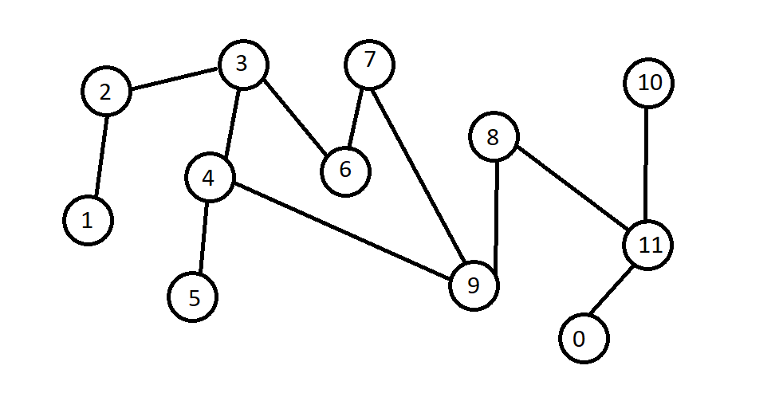

# alg-navigation-task

## Architecture
We have used python as language, and we used visual studio code for writing and github for version control/code sharing.
As for architecture, we have a main file that will run every other necessary file if needed. We have a file for both 
dijktra and depth first search algorithm. Those files will be called from main if you run the program with the proper 
command i.e. "-a dijkstra" or "-a dfs" these are the commands you can use when you run main.py. We have a map.txt
that we use to define our map, and graph.py will have the functions to make it the correct structure for our graph
algorithms.

## Algorithms and datastructures
- Explain each algorithm use in the program

#Dijkstra

Dijkstra function takes a graph(weighted) and a starting point,
sets all edges to be an infinitly large value 
then we go through all nodes and updates the weight,
the weight is stored in a priority queue sorted by smallest weight

#Depth first search

## User interface

