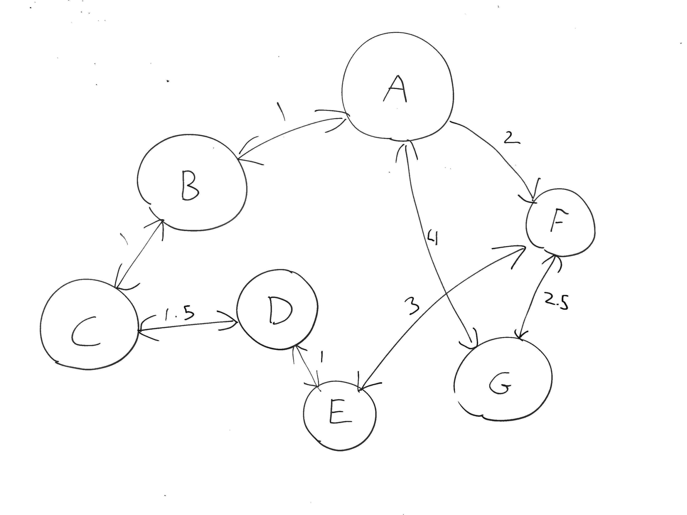

# alg-navigation-task



## Architecture
We have used python as our programming language, and we used visual studio code for development and github for version control/code sharing.
As for the architecture, we have a main file that will run every other necessary file if needed. The code for the Dijkstra and Depth First Search algorithms is contained in their own individual files. The files will be called from main if you run the program with the proper command i.e. "-a dijkstra" or "-a dfs". 

Our graph is represented in a .txt file (default `map.txt`) with the following format.
```
<vertex key> <vertex name>

<from vertex> <to vertex> <distance>
```

We use two data structures, a weighted directed graph and an indexed min priority queue which can be found in `graph.py` and `pq.py` respectively.

## Algorithms and datastructures

### Depth First Search

Depth First Search (DFS) is an algorithm for traversing graph data structures. The algorithm starts at some arbitrary node in the graph and explores as far as possible along each branch before backtracking. This makes it especially usefull for finding paths between very distant nodes.

This is oppersit to Breadth First Search (BFS) which visits all nodes at the current depth level before moving on to the nodes at the next depth level. This makes it ideal for finding the path with the least amount of edges between them. 

_NOTE: BFS is not implemented in our solution._

### Dijkstra

The Dijkstra algorithm takes a weighted graph and finds the shortest path between two noded based on the weight of each edge. The algorithm starts by settting all edges to an infinitly large value, it then traverses through all edges and stores the edge with the shorest distance to each node. The travesal is done in the order of the smallest distance first, this is done by using a priority queue.

## User interface


The user interface consists of a cli. You input the `START` and `DESTINATION` and then get directions for navigating between the two points. As can be seen in the picture above there is a number of opition flags that can be used to change how the program exicutes. 